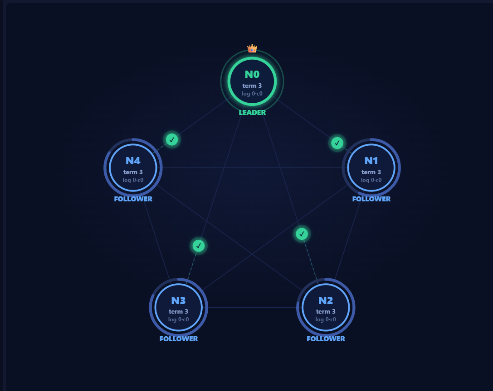

# Raft Consensus Visualizer

An interactive, in-browser visualization of the [Raft consensus algorithm](https://raft.github.io/raft.pdf) — leader election, log replication, and the failure modes that make Raft interesting. Plus a second view that runs a **fault-tolerant two-phase commit** on top of it, across several Raft groups at once.

**[▶ Live demo - Use it here!](https://raminshiraz.github.io/raft-visualizer/)**



No build step, no bundler, no CDN. Open `index.html` and it runs.

---

## Why another Raft visualizer?

There are two well-known ones already, and both are excellent:

- **[raftscope](https://raft.github.io/)** — by Diego Ongaro, Raft's author
- **[The Secret Lives of Data](http://thesecretlivesofdata.com/raft/)** — a guided narrative walkthrough

This one exists because both stop short of the parts that are hardest to understand. Specifically:

| | raftscope | Secret Lives | this |
|---|---|---|---|
| Leader election, heartbeats | ✅ | ✅ | ✅ |
| Crash / restart nodes | ✅ | — | ✅ |
| Clean network partitions | ✅ | ✅ | ✅ |
| **Per-link cuts, including one-way** | — | — | ✅ |
| **Log repair (`nextIndex` backtracking, truncation)** | partial | — | ✅ |
| **Figure 8 — the previous-term commit rule** | — | — | ✅ |
| **Figure 8 — the overwrite that rule prevents** | — | — | ✅ |
| **PreVote** | — | — | ✅ |
| **2PC over Raft — atomic commit across groups** | — | — | ✅ |
| **Safety invariants machine-checked** | — | — | ✅ |

The point of difference is the **pathological cases**. A clean 3–2 partition is easy to reason about. A node that can send but not receive is not, and it's the one that actually breaks naive implementations.

---

## What you can do

**Break the network in three different ways**

- **Crash a node** — click it. Its `currentTerm`, `votedFor` and `log[]` survive the restart, because in Raft those are persistent state.
- **Partition the cluster** — partition mode splits nodes into network groups, drawn as bubbles labelled `MAJORITY` or `minority — cannot elect`.
- **Cut a single wire** — click the line between any two nodes. Each click cycles it: healthy → fully cut → one-way → the other one-way → healthy.

That third one is the interesting one. A one-way cut models a node that is fully alive and still sending, but invisible to some peers — asymmetric connectivity, which is far more common in practice than a clean split and far nastier.

**Tune the network** — packet loss up to 60%, latency jitter up to ±80%. Dropped messages die visibly mid-flight with the reason attached.

**Toggle real-world extensions** — PreVote and the leader no-op append, so you can watch what breaks without them. Two scenarios are built to be run both ways: *One-way link* with PreVote off then on, and *Figure 8 — the overwrite* with the no-op off then on. In each case the toggle is the only thing that changes, and it decides whether the cluster survives.

**Run a distributed transaction** — switch to the *2PC over Raft* view and a coordinator group plus two participant shards appear, each one a full Raft cluster. Every `PREPARE`, vote and decision is an ordinary Raft log entry, and nothing is ever sent before the group that sends it has committed the record — the boxes under each group go from faded-dashed to solid as that happens. Resize any group from 1 to 7 nodes, live, mid-transaction. **Then turn off Replicated coordinator, crash the coordinator, and watch every shard sit holding locks for as long as it stays down.** Restart it and it finishes out of its own log — but nothing else can, and that wait is what replication removes.

**Step through it** — pause, step 120ms, or jump to the next event. Hover any in-flight message to inspect its full RPC payload.

**Read what's happening** — a live panel narrates the current phase and the reasoning behind it, not just the mechanics.

---

## The scenarios

### Raft cluster

Eight presets, roughly in order of subtlety:

| Scenario | What it demonstrates |
|---|---|
| **Cold start** | Randomized election timeouts; first to fire usually wins outright |
| **Kill the leader** | Detects the leader, crashes it, survivors elect a replacement in a higher term |
| **Split vote** | Even-sized cluster, simultaneous candidates. Nobody reaches quorum; the term is wasted |
| **Partition 3–2** | Majority keeps working; minority spins its term up and commits nothing |
| **One-way link** | A node that can send but never receive times out forever and repeatedly disrupts a healthy leader. **Turn on PreVote and watch it stop.** |
| **Stale follower repair** | A follower holds four entries from a dead term-2 leader. Watch `nextIndex` walk backwards until the logs match, then the bad tail is truncated |
| **Figure 8** | Every node stores an entry from an old term, replicated to all five — and the leader still refuses to commit it |
| **Figure 8 — the overwrite** | The counterexample that motivates the rule. An old-term entry reaches a majority and is then destroyed anyway. **Run it once with Leader no-op off, then again with it on.** |

The overwrite scenario answers the obvious objection — *surely a node with an old log could never win an election?* It can. N4 holds the only up-to-date log and is crashed, so it votes on nothing, while N2 and N3 hold **empty** logs and happily elect N0. Up-to-dateness is checked against the voters who answer, not against the whole cluster. X then reaches four of five nodes, is still not committed, and is overwritten the moment N4 comes back. Turn on Leader no-op and the same setup commits X instead — after which N4 can never win again.

Figure 8 is the one worth sitting with. Raft only commits entries from the leader's **own** term; an old entry replicated to every single node still stays uncommitted. Press *Client command* and both commit at once. This rule is the difference between a correct Raft and a subtly broken one.

For the repair scenario, drop the speed to 0.5× and use *Next event* — the backtracking is only a few hundred milliseconds otherwise.

### 2PC over Raft

Eight more, in the second view:

| Scenario | What it demonstrates |
|---|---|
| **Commit path** | The ordering that makes it fault tolerant: `BEGIN` is committed by the coordinator's group before a single `PREPARE` goes out, and each shard commits its own vote before answering |
| **A shard votes NO** | A refusal is Raft-committed exactly like a yes. One is enough; the shard that already locked releases |
| **Shard leader dies after PREPARED** | The only node that ever spoke to the coordinator is crashed. Its replacement answers `PREPARED` for a transaction it never saw, out of the replicated log |
| **Coordinator dies — one machine** | The blocking problem, reproduced. Both shards hold locks until that one machine comes back, and restarting it is the only way out. **Then turn on Replicated coordinator and load it again** |
| **Coordinator dies — replicated** | Same script, three-node coordinator. The volatile vote tally dies with the old leader; the durable records do not, and the transaction finishes |
| **Coordinator cut off from a shard** | Presumed abort on the deadline. Press *Heal network* afterwards and watch the shard learn the outcome late |
| **Shard loses quorum** | `PREPARE` arrives at a group that can never elect and dies on the ring. Raft stops rather than risk split brain; 2PC presumes abort |
| **Prepare timeout — presumed abort** | Nothing crashed, nothing cut, just 45% packet loss. Indistinguishable from the other two failures, which is the whole point |

*Coordinator dies* and *Coordinator dies — replicated* are the pair to read together, exactly like the two Figure 8 scenarios. The script is identical; the only difference is whether the coordinator's records live on one machine or on a majority of three. In the first, two shards hold locks until that machine comes back, and no amount of retrying helps — click it to restart it and it does finish, out of its own log, but nothing else can. In the second, a new leader finds `BEGIN` on the majority, asks the shards again, and finishes the job the dead machine started. That difference — one disk write becoming a committed consensus record — is the entire content of Gray and Lamport's *Consensus on Transaction Commit*, and it is why Spanner runs 2PC across Paxos groups.

Also worth doing once: load *Shard leader dies after PREPARED*, then turn **Leader no-op** off and load it again. The new shard leader now holds the vote but cannot commit an entry from the old term, so it stays silent and the transaction times out. That is Figure 8 with a transaction riding on it.

---

## Correctness

The simulation is not animation over a hand-waved state machine. It implements Figure 2 of the paper: `prevLogIndex`/`prevLogTerm` consistency checks, conflicting-entry truncation, `nextIndex[]` backtracking with fast term-skip, `matchIndex[]`, and majority commit gated on the leader's current term.

To keep it honest, `npm test` loads the **same `app.js` the browser runs** and asserts the paper's four safety properties after every simulated 40ms tick, under randomized chaos — and then does the same for the 2PC layer on top of it.

Every row is **replayed across 50 seeds**, and the randomness is seeded at both ends — the engine's own `Math.random` and the chaos functions — so a run is entirely determined by its seed. That matters twice: one sample per row meant a rare safety bug passed CI most of the time, and on the run where it did not there was nothing to reproduce it with. A failing row now prints the seed that produced it:

```
FAIL  scenario: figure8Lost                 50 seeds  leader=y  maxCommit=1
        ! seed 1 — replay with:  npm test -- --seed=1
        ! LEADER COMPLETENESS: leader N4 lost committed index 1
```

`--seed=N` replays exactly; `--seeds=N` widens the sweep when hunting something rare.

```
$ npm test
Raft safety verification — engine loaded from app.js

PASS  healthy cluster + client writes       50 seeds  leader=y  maxCommit=22
PASS  random crash / restart                50 seeds  leader=y  maxCommit=30
PASS  flapping network partitions           50 seeds  leader=y  maxCommit=49
PASS  35% packet loss                       50 seeds  leader=y  maxCommit=18
PASS  random link cuts (incl. one-way)      50 seeds  leader=y  maxCommit=42
PASS  links + partitions + crashes + loss   50 seeds  leader=y  maxCommit=4
PASS  one-way isolated node cannot win      50 seeds  leader=y  maxCommit=0
PASS  scenario: fresh                       50 seeds  leader=y  maxCommit=8
PASS  scenario: killLeader                  50 seeds  leader=y  maxCommit=7
PASS  scenario: splitVote                   50 seeds  leader=y  maxCommit=8
PASS  scenario: partition                   50 seeds  leader=y  maxCommit=8
PASS  scenario: repair                      50 seeds  leader=y  maxCommit=13
PASS  scenario: asymmetric                  50 seeds  leader=y  maxCommit=5
PASS  scenario: figure8                     50 seeds  leader=y  maxCommit=10
PASS  scenario: figure8Lost                 50 seeds  leader=y  maxCommit=8
PASS  prevote + links + crashes + loss      50 seeds  leader=y  maxCommit=33
PASS  prevote: cut link, leader holds       50 seeds  disrupted 0/50  term 1->2  (expected no disruption every time)
PASS  prevote: one-way lo2hi, holds         50 seeds  disrupted 0/50  term 1->2  (expected no disruption every time)
PASS  prevote: one-way hi2lo, holds         50 seeds  disrupted 0/50  term 1->2  (expected no disruption every time)
PASS  no prevote: same cut disrupts         50 seeds  disrupted 50/50  term 1->11  (expected disruption every time)
PASS  prevote: disruptor stays quiet        50 seeds  worst N4 term=0  last: N4 term=0 state=follower  cluster terms=[1,1,1,1]
PASS  prevote: re-elect after crash        median 4.2s -> 5.5s  max 12.4s -> 27.1s
PASS  liveness: cold starts                 50 seeds  slow(>15s)=0

PASS  2pc: happy path commits everywhere    50 seeds  verdict 50/50  phase=committed  applied=2/2  locked=0
PASS  2pc: a NO vote aborts everywhere      50 seeds  verdict 50/50  phase=aborted  applied=2/2  locked=0
PASS  2pc: shard leader dies, log answers   50 seeds  verdict 50/50  phase=committed  applied=2/2  locked=0
PASS  2pc: lone coordinator BLOCKS (ctl)    50 seeds  verdict 50/50  locked=2/2  applied=0  (expected BLOCKED)
PASS  2pc: crashed coord forgets its tally  50 seeds  verdict 50/50  restarted=true  tally emptied on restart=true
PASS  2pc: replicated coord recovers        50 seeds  verdict 50/50  phase=committed  applied=2/2  locked=0  (expected RECOVERY)
PASS  2pc: stale Prepare after apply        50 seeds  verdict 50/50  SHARD B applied=abort vote=null  vote records 0 -> 0
PASS  2pc: presumed abort on timeout        50 seeds  verdict 50/50  decision=abort  shard A applied=abort
PASS  2pc: atomicity under chaos            50 seeds  verdict 50/50  phase=aborted  safety only, liveness not asserted
PASS  2pc scenario: happy                   50 seeds  verdict 50/50  phase=committed  applied=2/2  locked=0
PASS  2pc scenario: voteNo                  50 seeds  verdict 50/50  phase=aborted  applied=2/2  locked=0
PASS  2pc scenario: shardLeaderDies         50 seeds  verdict 50/50  phase=committed  applied=2/2  locked=0
PASS  2pc scenario: coordDies               50 seeds  verdict 50/50  phase=preparing  applied=0/2  locked=2
PASS  2pc scenario: coordDiesFT             50 seeds  verdict 50/50  phase=committed  applied=2/2  locked=0
PASS  2pc scenario: cutShard                50 seeds  verdict 50/50  phase=aborting  applied=1/2  locked=0
PASS  2pc scenario: shardNoQuorum           50 seeds  verdict 50/50  phase=aborting  applied=1/2  locked=0
PASS  2pc scenario: slowShard               50 seeds  verdict 50/50  phase=committed  applied=2/2  locked=0

ALL INVARIANTS HELD
```

The PreVote rows are the ones to read as a pair. `no prevote: same cut disrupts` is a deliberate **negative control**: cutting one link from the leader must knock it out of office when PreVote is off, or the three rows above it — which assert the leader survives that same cut with PreVote on — would pass without proving anything.

`2pc: lone coordinator BLOCKS (ctl)` is the second deliberate negative control, and it earns its keep the same way. An unreplicated coordinator, crashed once both shards have voted yes, **must** leave them locked and unable to finish. Without that row, `2pc: replicated coord recovers` would prove nothing — a transaction that would have completed anyway also completes with replication on.

Checked continuously:

- **Election Safety** — at most one leader per term
- **Log Matching** — identical index + term implies identical prefix
- **State Machine Safety** — a committed index never changes value
- **Leader Completeness** — a leader holds every previously committed entry

And for the 2PC layer, on top of all four checked separately in every group:

- **Atomicity** — no two shards ever reach opposite outcomes
- **Decision stability** — once the coordinator's decision is committed, it never changes
- **No premature apply** — no shard applies anything the coordinator has not committed
- **No double record** — one decision, one vote and one apply per transaction per node, which is what stops a crash committing both an abort and a commit

One row deserves reading carefully. `links + partitions + crashes + loss` reports `leader=n maxCommit=0`: under that much simultaneous damage the cluster never elected anyone and committed nothing for the entire run. That is correct behaviour, not a failure — Raft stops rather than risk split brain. **The suite asserts safety, not liveness**, and makes no claim that progress is possible under arbitrary faults. Liveness is checked separately, and only for a healthy cluster. `2pc: atomicity under chaos` takes the same stance, and the `2pc scenario:` rows assert only that every invariant holds on the way — `2pc scenario: coordDies` is *supposed* to finish with `locked=2`, because blocking is the entire reason that scenario exists.

---

## Known simplifications

Honest list of where this departs from a production Raft:

- **No log compaction / snapshots.** Logs grow forever.
- **No cluster membership changes.** Adding a node takes effect immediately, with no joint consensus and no catch-up phase — a new node is a full voter with an empty log from the moment it appears. Do not read the add/remove buttons as a model of reconfiguration. The `Nodes` stepper is disabled while any node is down, because resizing around a node that is behind can genuinely destroy a committed entry: `−` pops by position regardless of what that node holds, and enough empty voters form a majority that no up-to-date check can veto.
- **No persistence layer.** "Persistent" state survives a simulated crash because it lives in the same object; there is no fsync to model.
- **`AppendEntries` sends the whole tail** from `nextIndex` onward rather than a bounded batch. Correct, just not what you would ship.
- **Simulated time.** One virtual clock, no real concurrency, so there are no genuine races — message interleaving is driven by latency jitter instead.

And for the two-phase commit view specifically:

- **One transaction at a time.** No concurrency control and no lock manager beyond a per-shard flag, so there is nothing to deadlock and nothing to schedule.
- **Presumed abort only.** No 3PC, no Paxos Commit's per-participant consensus instance — the coordinator group is the only consensus in the decision path.
- **A restarted coordinator asks again rather than presuming abort.** Textbook presumed-abort recovery aborts any transaction the coordinator holds no commit record for. This one finds `BEGIN` with no decision, re-sends `PREPARE`, and can still commit. That is safe, because it had decided nothing before the crash, and it is the same path a newly elected leader of the replicated coordinator takes.
- **No cooperative termination protocol.** A blocked participant never asks the other shards how it ended. That would not rescue *Coordinator dies — one machine* anyway: the crash lands after every shard has voted yes and before any decision exists, so each shard would only learn that the others are just as in doubt. Asking around helps only when some participant already knows the outcome, or has not voted yet and can still abort — it makes blocking rarer, never impossible. The coordinator coming back is what ends it; replicating the coordinator is what avoids it.
- **Shards do not run a state machine.** "Applied" means the shard committed a record saying so; there is no key-value store underneath to mutate.

---

## Running it

Just open `index.html` — it works straight off the filesystem.

To serve it over HTTP:

```bash
npm run serve      # http://localhost:8080
```

To run the safety suite (no dependencies needed):

```bash
npm test
```

To edit the simulation, change a file in `src/` and rebuild:

```bash
npm install
npm run build      # src/*.jsx -> app.js
```

`app.js` is committed so a bare checkout and GitHub Pages both work with no build step. React and ReactDOM are vendored in `vendor/` (~140 KB total) so the page has no network dependency at all.

### Layout

```
index.html            page shell, styles, library-load diagnostics
src/                  source, split by concern:
  constants.jsx         timings, node model, log helpers, colour scales
  raft-engine.jsx       elections, replication, RPC delivery, tick
  raft-scenarios.jsx    makeWorld, membership, SCENARIOS
  txn-engine.jsx        two-phase commit over the engine above
  txn-scenarios.jsx     TXN_SCENARIOS
  layout.jsx            single-cluster ring geometry
  explain.jsx           live narration for both views
  app.jsx               root component, controls, page layout
  stage.jsx             cluster SVG + drawing shared with the 2PC stage
  txn-stage.jsx         2PC SVG: groups, small nodes, cross-group RPCs
  panels.jsx            side panels and the tooltip
  mount.jsx             renders <App/> — always concatenated last
app.js                compiled output (committed)
build.mjs             src/*.jsx -> app.js, and the file order
test/verify.mjs       headless safety-invariant suite
vendor/               React 18 UMD builds
```

**The files in `src/` are fragments of one classic script, not modules.** They share a single top-level scope and contain no `import` or `export`; `build.mjs` compiles each with Babel's JSX transform and concatenates them in the order listed in its `SOURCES` array, which is the dependency order. That is deliberate: `index.html` loads `app.js` with a plain `<script>` tag, and ES modules are blocked by CORS over `file://`. Splitting into real modules — or reaching for a bundler — would cost the "just open `index.html`" promise, which is the point of the repo. `build.mjs` fails the build if a `src/` file grows an `import`.

The Raft engine is plain functions over a mutable world object and has no React dependency — that is what lets the test suite drive it headlessly. The 2PC layer sits directly on top of it, and is equally React-free: it is plain functions over a transaction world that holds one Raft world per group, so the same suite drives both. There are no new files and no new dependencies.

---

## Credit

Based on **[In Search of an Understandable Consensus Algorithm (Extended Version)](https://raft.github.io/raft.pdf)** by Diego Ongaro and John Ousterhout, USENIX ATC 2014. PreVote and the leader no-op follow Ongaro's PhD thesis, *Consensus: Bridging Theory and Practice* (2014), §9.6 and §6.4.

The two-phase commit view follows **[Consensus on Transaction Commit](https://www.microsoft.com/en-us/research/publication/consensus-on-transaction-commit/)** by Jim Gray and Leslie Lamport (ACM TODS, 2006) — the paper that replaces the coordinator's single disk write with a consensus-committed record. It uses Raft where that paper uses Paxos, which is the arrangement Spanner ships.

Any deviation from the paper is a bug — please open an issue.

## License

MIT — see [LICENSE](LICENSE).
